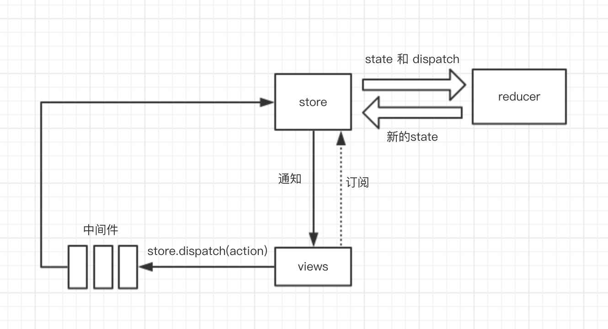

# 从零实现 redux

### 状态管理

##### 无计划的状态管理

redux 本身是一个状态管理器，可以对数据状态进行一系列的操作，例如

```js
// count 状态
let state = { count: 1 };

//打印状态
console.log(state.count);

//修改状态
state.count = 2;
```

以上即为最简单的状态保存和修改，但是这里有一个问题，即不能在 count 更改后通知使用 count 的地方，这里我们可以用订阅/发布者模式实现一下:

```js
createStore(initState) {
    let state = initState;

    let listeners = [];

    //订阅
    function subscribe (listener) {
        listeners.push(listener);
    }

    //修改
    function changeState (newState) {
        state = newState;
        for(let i = 0; i < listeners.length; i++) {
            listeners[i]();
        }
    }

    function getState () {
        return state;
    }
    return {
        subscribe,
        changeState,
        getState
    }
 }
```

这里我们实现了一个简单的状态管理器，主要导出 subscribe（订阅）/changeState（修改）/getState（获取）三个接口。下面可以使用例子测试一下：

```js
import createStore from "./redux/index";

let initState = {
  counter: {
    count: 1
  },
  info: {
    name: "first",
    description: "hhh"
  }
};

let store = createStore(initState);

store.subscribe(() => {
  let state = store.getState();
  console.log(state.counter.count);
});

store.subscribe(() => {
  let state = store.getState();
  console.log(`${state.info.name}:${state.info.description}`);
});

store.changeState({
  ...store.getState(),
  counter: {
    count: 2
  }
});
// 2
// first:hhh

store.changeState({
  ...store.getState(),
  info: {
    name: "222",
    description: "lalala"
  }
});
// 2
// 222:lalala
```

**_代码见 demo1_**

##### 有计划的状态管理

上面的代码存在一些问题，例如:

```js
store.changeState({
  ...store.getState(),
  counter: {
    key: 111
  }
});
```

我们会发现 counter 的结构直接被改变了，状态的修改没有任何约束。  
这里我们只想要 count 有自增或者自减两种状态改变，那么我们可以只暴露自增和自减两种方法，整个实现分为两步：

1. 制定一个 plan 来修改 count 的状态，里面包含自增和自减两个方法。
2. 修改 changeState 方法，在执行时按照 plan 的方法执行。

```js
//制定plan
function plan(state, action) {
  switch (action.type) {
    case "INCREMENT":
      return {
        ...state,
        count: state.count + 1
      };
    case "DECREMENT":
      return {
        ...state,
        count: state.count - 1
      };
    default:
      return state;
  }
}

//为createStore函数添加plan参数
function createStore(plan, initState) {
  let state = initState;
  let listeners = [];
  function subscribe(listener) {
    listeners.push(listener);
  }

  function changeState(action) {
    state = plan(state, action);
    for (let i = 0; i < listeners.length; i++) {
      listeners[i]();
    }
  }

  function getState() {
    return state;
  }
  return {
    subscribe,
    changeState,
    getState
  };
}
```

现在来测试一下

```js
let initState = {
  count: 0
};

let store = createStore(plan, initState);

store.subscribe(() => {
  let state = store.getState();
  console.log(state.count);
});

store.changeState({
  type: "DECREMENT"
});

store.changeState({
  type: "INCREMENT"
});

store.changeState({
  count: "sss"
});

//-1
//0
//0
```

现在我们规定了数据的改变方式，只在我们允许的 action.type 中改变数据状态。在 redux 中，reducer 就相当于现在的 plan，dispatch 相当于现在的 changeState。
**_代码见 demo2_**

### 拆分 reducer

在一个项目中，势必会有许多不同组件 state 的 reducer,像之前的写法势必会让一个 reducer 文件过于庞大而且难以维护，那么这里可以将不同组件 state 的 reducer 拆分成单个文件，最后再组合起来。例如对于以下状态

```js
let initState = {
  counter: {
    count: 1
  },
  info: {
    name: "小明",
    description: "爱上了阿芬"
  }
};
```

我们可以拆分为 counterReducer 和 infoReducer

```js
function counterReducer(state, action) {
  switch (action.type) {
    case "INCREMENT":
      return {
        ...state,
        count: state.count + 1
      };
    case "DECREMENT":
      return {
        ...state,
        count: state.count - 1
      };
    default:
      return state;
  }
}

function infoReducer(state, action) {
  switch (action.type) {
    case "setName":
      return {
        ...state,
        name: action.name
      };
    case "setDescription":
      return {
        ...state,
        description: action.description
      };
    default:
      return state;
  }

```

接下来就是创建一个方法将两个 reducer 合并起来，我们想要的是如下的执行方法

```js
let reducer = combineReducer({
  counter: counterReducer,
  info: infoReducer
});
```

那么我们需要根据传入对象的 key-value 来返回一个 function，这个 function 需要对所有的 reducer 执行并返回结合后的状态（返回了整个状态树）

```js
function combineReducers(reducers) {
  let keys = Object.keys(reducers);

  return function combination(state, action) {
    let nextState = {};

    for (let i = 0; i < keys.length; i++) {
      let key = keys[i];
      let reducer = reducers[key];
      let preState = state[key];
      //执行相应的reducer获取当前key下个状态的数据
      nextState[key] = reducer(preState, action);
    }
    //最后将所有keys的状态更新
    return nextState;
  };
}
```

接下来可以看下实际的使用例子：

```js
import { createStore, combineReducers } from "./redux";
import counterReducer from "./reducer/counterReducer";
import infoReducer from "./reducer/infoReducer";

let initState = {
  counter: {
    count: 1
  },
  info: {
    name: "小明",
    description: "爱上了阿芬"
  }
};

let reducer = combineReducers({
  counter: counterReducer,
  info: infoReducer
});

let store = createStore(reducer, initState);

store.subscribe(() => {
  let state = store.getState();
  console.log(state.counter.count);
});

store.subscribe(() => {
  let state = store.getState();
  console.log(state.info.name + state.info.description);
});

store.dispatch({
  type: "DECREMENT"
});

store.dispatch({
  type: "setName",
  name: "阿芬"
});

store.dispatch({
  type: "setDescription",
  description: "不爱小明"
});
//0
//小明爱上了阿芬
//0
//阿芬爱上了阿芬
//0
```

**_代码见 demo3_**

### 拆分不同组件的 state

上面我们拆分了 reducer，同样的，实际业务中将整个 store 定义在一起也会出现单个对象结构过于复杂的问题，那么这里我们将 state 拆分到各自的 reducer 中。如下：

```js
// infoReducer.js
let initState = {
  name: '小白',
  description: '真黑啊'
}

export default function infoReducer(state, action) {
  //通过闭包管理初始赋值
  if(!state) {
    state = initState;
  }
  switch (action.type) {
    case "setName":
      return {
        ...state,
        name: action.name
      };
    case "setDescription":
      return {
        ...state,
        description: action.description
      };
    default:
      return state;
  }
}

// counterReducer.js
let initState = {
  count: 1
}
export default function counterReducer(state, action) {
  //通过闭包管理初始赋值
  if(!state) {
    state = initState;
  }
  switch (action.type) {
    case "INCREMENT":
      return {
        ...state,
        count: state.count + 1
      };
    case "DECREMENT":
      return {
        ...state,
        count: state.count - 1
      };
    default:
      return state;
  }
}

```

相应的，在执行 createStore 函数时，需要将所有状态的初始值提取出来组合 state，考虑到所有的 reducer 在`switch`判断进入`default`时会返回 state 自身，可以通过 dispatch 一次唯一的 type 的类型来获取初始值，这里使用 es6 中的 Symbal 来当唯一的 type，保证所有 reducer 进入`default`。

```js
export default function createStore(reducer, initState) {
  let state = initState;
  let listeners = [];
  function subscribe(listener) {
    listeners.push(listener);
  }

  function dispatch(action) {
    state = reducer(state, action);
    for (let i = 0; i < listeners.length; i++) {
      listeners[i]();
    }
  }
  //触发dispatch来执行所有reducer的default进行初始化
  dispatch({ type: Symbol() });

  function getState() {
    return state;
  }
  return {
    subscribe,
    dispatch,
    getState
  };
}
```

来执行一下

```js
import { createStore, combineReducers } from "./redux";
import counterReducer from "./reducer/counterReducer";
import infoReducer from "./reducer/infoReducer";

let reducer = combineReducers({
  counter: counterReducer,
  info: infoReducer
});

let store = createStore(reducer);

store.subscribe(() => {
  let state = store.getState();
  console.log(state.counter.count);
});

store.subscribe(() => {
  let state = store.getState();
  console.log(state.info.name + state.info.description);
});

store.dispatch({
  type: "DECREMENT"
});

store.dispatch({
  type: "setName",
  name: "阿芬"
});

store.dispatch({
  type: "setDescription",
  description: "不爱小明"
});

//0
//小白真黑啊
//0
//阿芬真黑啊
//0
//阿芬不爱小明
```

**_代码见 demo4_**

### 中间件 middleware

中间件在 redux 中是一个比较难以理解的概念，中间件是通过对 redux 中 dispatch 重写，来实现增强其功能的目的。

##### 记录日志

简单来说，我们现在需要增加一个日志功能，需要记录每次修改操作前的数据和修改后的数据，因为之前的数据 subscribe 无法记录，这里我们就需要一个简单的中间件来实现了

```js
//这里只使用counterReducer
const store = createStore(reducer);
const next = store.dispatch;

//修改原dispatch
store.dispatch = action => {
  let state = store.getState();
  console.log("pre state", state);
  console.log("action", action);
  next(action);
  state = store.getState();
  console.log("next state", state);
};

//测试
store.dispatch({
  type: "INCREMENT"
});

// pre state { counter: { count: 0 } }
// action { type: 'INCREMENT' }
// next state { counter: { count: 1 } }
```

##### 记录异常

这是我们又有另一个需求需要记录 redux 修改状态时的异常。那么使用中间件：

```js
const store = createStore(reducer);
const next = store.dispatch;

store.dispatch = action => {
  try {
    next(action);
  } catch (err) {
    console.log(err);
  }
};
```

这样每次修改出现异常的话就会打印出来。

##### 中间件的合作

那么加入我们要同时实现上面两个需求呢？最简单的是直接合并起来写进同一个函数体内，但是如果需求变多的话，一个`store.dispatch`会变得非常复杂。这里我们想办法将不同功能独立出去。

1.  首先我们先把 loggerMiddleware 提取出来：

```js
const store = createStore(reducer);
const next = store.dispatch;

const loggerMiddleware = action => {
  console.log("pre state", store.getState());
  console.log("action", action);
  next(action);
  console.log("next state", store.getState());
};

store.dispatch = action => {
  try {
    loggerMiddleware(action);
  } catch {
    console.log(err);
  }
};
```

2. 把 exceptMiddleware 提取出来：

```js
const exceptMiddleware = action => {
  try {
    loggerMiddleware(action);
  } catch {
    console.log(err);
  }
};

store.dispatch = exceptMiddleware;
```

3. 这里有一个问题，exceptMiddleware 中写死了 loggerMiddleware 中间件，我们需要可以动态传入，随便哪个中间件都可以：

```js
const exceptMiddleware = next => action => {
  try {
    //loggerMiddleware(action);
    next(action);
  } catch {
    console.log(err);
  }
};
```

4. 同样的，loggerMiddleware 中的 next 也恒等于`store.dispatch`，照着上面也写成动态的。

```js
const loggerMiddleware = next => action => {
  console.log("pre state", store.getState());
  console.log("action", action);
  next(action);
  console.log("next state", store.getState());
};
```

至此，我们已经实现了一个扩展性很强的中间件模式，那么完整的写法就是

```js
const store = createStore(reducer);
const next = store.dispatch;

const loggerMiddleware = next => action => {
  console.log("pre state", store.getState());
  console.log("action", action);
  next(action);
  console.log("next state", store.getState());
};

const exceptMiddleware = next => action => {
  try {
    next(action);
  } catch (err) {
    console.log("错误报告: ", err);
  }
};

store.dispatch = exceptMiddleware(loggerMiddleware(next));
```

当我们新建了两个文件`loggerMiddleware.js`和`exceptMiddleware.js`两个文件，想要把两个方法分离到两个文件中时，新的问题出现了，我们的 store 是唯一的，两个方法都需要 store，那么我们将 store 也分离出去

```js
const store = createStore(reducer);
const next = store.dispatch;

const loggerMiddleware = store => next => action => {
  console.log("pre state", store.getState());
  console.log("action", action);
  next(action);
  console.log("next state", store.getState());
};

const exceptMiddleware = store => next => action => {
  try {
    next(action);
  } catch (err) {
    console.log(err);
  }
};

const logger = loggerMiddleware(store);
const exception = exceptMiddleware(store);
store.dispatch = exception(logger(next));
```

至此我们成功实现了中间件，假如我们新加入一个在打印日志前输出当前时间戳的需求呢

```js
const timeMiddleware = store => next => action => {
  console.log("time", new Date().getTime());
  next(action);
};

const time = timeMiddleware(store);
store.dispatch = exception(time(logger(next)));
```

**_代码见 demo5_**

### 优化中间件使用方法

在上面使用中间件时，需要用 store 作为参数对每个中间件显式传参，最后还要写成嵌套的函数，用起来太过繁琐、不直观。我们期望的应该是直接将中间件按顺序传入某个函数后自动生成，因为最终修改的是`dispatch`，那我们直接修改 createStore 函数来实现。下面是期望的使用形式。

```js
//接收旧的 createStore，返回新的 createStore
const newCreateStore = applyMiddleware(
  exceptMiddleware,
  timeMiddleware,
  loggerMiddleware
)(createStore);

//返回了一个 dispatch 被重写过的 store
const store = newCreateStore(reducer);
```

具体实现

```js
function applyMiddleware(...middlewares) {
  return function rewriteCreateStore(oldCreateStore) {
    return function newCreateStore(reducer, initstate) {
      //先实例旧的store
      let store = oldCreateStore(reducer, initstate);
      //给所有中间件传入store
      let chain = middlewares.map(item => {
        return item(store);
      });
      //组合中间件
      let dispatch = store.dispatch;
      chain.reverse().map(item => {
        dispatch = item(dispatch);
      });
      //重写store.dispatch并返回新的store
      store.dispatch = dispatch;
      return store;
    };
  };
}
```

写到这里，我们有两个 createStore，例如：

```js
//没有中间件
const store = createStore(reducer);
//有中间件
const newCreateStore = applyMiddleware(
  exceptMiddleware,
  timeMiddleware,
  loggerMiddleware
)(createStore);
const store = newCreateStore(reducer);
```

我们可以统一写进 createStore 函数中，通过选填的参数进行判断生成 store

```js
function createStore (reducer, initState, rewriteCreateStoreFunc) {
  //添加判断
  if(rewriteCreateStoreFunc) {
    const newCreateStore = rewriteCreateStoreFunc(createStore);
    return newCreateStore(reducer,initState);
  }
  ···
}
```

最终用法

```js
const rewriteCreateStoreFunc = applyMiddleware(
  exceptMiddleware,
  timeMiddleware,
  loggerMiddleware
);

const store = createStore(reducer, initState, rewriteCreateStoreFunc);
```

**_代码见 demo6_**

### 完善 redux

1. 添加事件解绑,修改`store.subscribe`方法。

```js
//如果某个订阅者在运行时会解绑事件，那么会导致订阅出错，建议将listeners拷贝一份来执行，保证dispatch时队列的不变。
function subscribe(listener) {
  listeners.push(listener);
  return function unsubscribe() {
    const index = listeners.indexOf(listener);
    listeners.splice(index);
  };
}

function dispatch(action) {
  state = reducer(state, action);
  let copy = listeners.slice();
  for (let i = 0; i < copy.length; i++) {
    copy[i]();
  }
}
```

使用

```js
const unsub = store.subscribe(() => {
  console.log(1);
});

unsub();
```

2.控制中间件权限，现在的中间件拿到的是完整的 store，中间件甚至可以修改 store 上的方法，按照最小权限的原则，我们只需要传`store.getState`方法即可。

```js
let chain = middlewares.map(item => {
  //return item(store);
  return item({ getState: store.getState });
});
```

3. 省略initState
有时候创建store时我们不传入initState，此时我们的写法为
```js
const store = createStore(reducer, {}, rewriteCreateStoreFunc);
```
redux允许这么写
```js
const store = createStore(reducer,  rewriteCreateStoreFunc);
```
这里只需要判断下第二个参数是否为对象再进行下一步操作
```js
function craeteStore(reducer, initState, rewriteCreateStoreFunc){
    if (typeof initState === 'function'){
    rewriteCreateStoreFunc = initState;
    initState = {};
  }
  ...
}
```
4. bindActionCreators
这个功能一般出现在react-redux中，通过闭包隐藏dispatch和actionCreator,只暴露action来进行状态操作。   
这里我们先自己实现一下隐藏dispatch和actionCreator
```js
const reducer = combineReducers({
  counter: counterReducer,
  info: infoReducer
});
const store = createStore(reducer);

/*返回 action 的函数就叫 actionCreator*/
function increment() {
  return {
    type: 'INCREMENT'
  }
}

function setName(name) {
  return {
    type: 'SET_NAME',
    name: name
  }
}

const actions = {
  increment: function () {
    return store.dispatch(increment.apply(this, arguments))
  },
  setName: function () {
    return store.dispatch(setName.apply(this, arguments))
  }
}
/*注意：我们可以把 actions 传到任何地方去*/
/*其他地方在实现自增的时候，根本不知道 dispatch，actionCreator等细节*/
actions.increment(); /*自增*/
actions.setName('九部威武'); /*修改 info.name*/
```
那么我们现在可以提炼一下整个函数的使用形式
```js
const actions = bindActionCreators({ increment, setName }, store.dispatch);
```
以下是bindActionCreators的源码实现
```js
/*核心的代码在这里，通过闭包隐藏了 actionCreator 和 dispatch*/
function bindActionCreator(actionCreator, dispatch) {
  return function () {
    return dispatch(actionCreator.apply(this, arguments))
  }
}

/* actionCreators 必须是 function 或者 object */
export default function bindActionCreators(actionCreators, dispatch) {
  if (typeof actionCreators === 'function') {
    return bindActionCreator(actionCreators, dispatch)
  }

  if (typeof actionCreators !== 'object' || actionCreators === null) {
    throw new Error()
  }

  const keys = Object.keys(actionCreators)
  const boundActionCreators = {}
  for (let i = 0; i < keys.length; i++) {
    const key = keys[i]
    const actionCreator = actionCreators[key]
    if (typeof actionCreator === 'function') {
      boundActionCreators[key] = bindActionCreator(actionCreator, dispatch)
    }
  }
  return boundActionCreators
}
```

## 总结
总结一下整个过程中使用的redux中的名词
1. createStore  
返回store对象，包含dispatch，getState，subscribe等方法
2. reducer    
计划函数，接收action和newState，表示可以怎样对状态进行修改
3. action   
action是一个包含type字段的对象。
4. dispatch    
接收action，通知store进行状态修改。
5. subscribe   
每次状态改变执行参数中的回调。
6. combineReducers    
合并计划函数。
7. middleWare   
中间件，对原dispatch的功能增强。   

附：
1. redux功能图
   
2. [代码地址](https://github.com/fallenleaves409/redux-demo)
